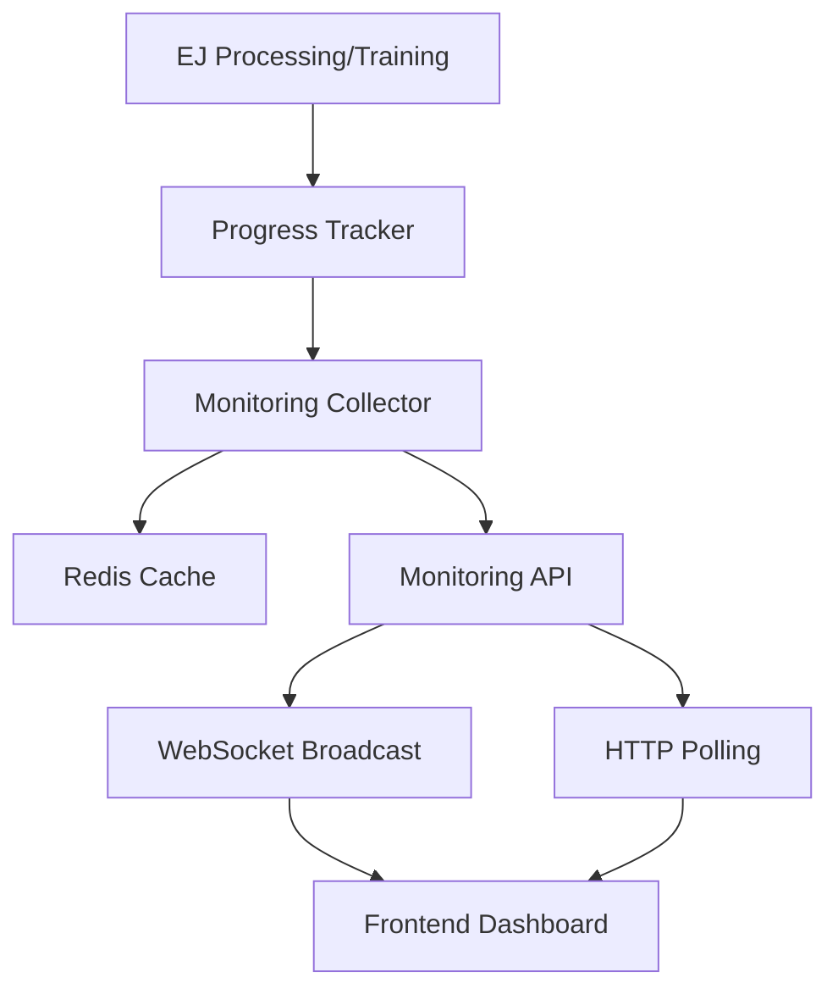

# Enhanced Real-time Monitoring System - Implementation Summary

## 🎯 **Objective Achieved**
Successfully enhanced the real-time monitoring page at `http://localhost/dashboard/realtime` to show detailed progress for:
- ✅ EJ file loading and processing
- ✅ Model training progress
- ✅ System performance metrics

## 🚀 **Key Enhancements Implemented**

### 1. **Enhanced Progress Tracking Backend**
- **File**: `services/api/monitoring_utils.py`
- **Features**:
  - Thread-safe `ProgressTracker` class for operation tracking
  - Enhanced `MonitoringCollector` with detailed component statistics
  - Progress tracking for EJ processing and model training
  - ETA calculations and rate monitoring
  - Error tracking and status management

### 2. **EJ File Processing Progress**
- **File**: `services/api/main.py` (batch_process_ej_files function)
- **Features**:
  - Real-time progress tracking with file counts and percentages
  - Current file being processed display
  - Processing rate calculations (files/second)
  - ETA estimates for completion
  - Error count and error handling
  - Progress bars in frontend

### 3. **Model Training Progress**
- **File**: `services/api/main.py` (train_supervised_classifier function)
- **Features**:
  - Step-by-step training progress (5 major steps)
  - Real-time accuracy updates
  - Training sample counts
  - Model type identification
  - Training time and ETA tracking
  - Progress visualization

### 4. **Enhanced Monitoring API**
- **Endpoint**: `/api/v1/monitoring/status`
- **Features**:
  - Comprehensive progress data integration
  - Active operations tracking
  - Enhanced data structure with progress_percent fields
  - WebSocket broadcasting for real-time updates

### 5. **Improved Frontend Interface**
- **File**: `services/dashboard/src/RealtimeMonitoringInterface.js`
- **Features**:
  - **EJ File Processing Card**:
    - Progress bar with percentage completion
    - Current file being processed
    - Files processed count (X/Y format)
    - Processing rate display
    - ETA countdown
    - Error count with color coding
  
  - **Model Training Card**:
    - Training progress bar
    - Model type display
    - Current epoch/total epochs
    - Real-time accuracy updates
    - Training samples count
    - Loss values (when available)
    - ETA for training completion

  - **Enhanced System Monitoring**:
    - Real-time CPU and memory usage
    - System uptime
    - Active process counts

## 📊 **Data Flow Architecture**



## 🔧 **Technical Implementation Details**

### Progress Tracking Functions
```python
# Start tracking an operation
operation_id = start_ej_processing(total_files=10)

# Update progress
update_ej_processing_progress(operation_id, completed_files=5, current_file="session_001.txt")

# Complete operation
complete_ej_processing(operation_id, success=True)
```

### Monitoring Data Structure
```javascript
{
  parsing: {
    status: "active",
    processed: 5,
    total_files: 10,
    current_file: "session_001.txt",
    progress_percent: 50.0,
    processing_rate: 2.5,
    eta_seconds: 2.0,
    errors: 0
  },
  ml_training: {
    status: "training",
    model_type: "RandomForestClassifier",
    training_progress: 60.0,
    current_epoch: 3,
    total_epochs: 5,
    current_accuracy: 0.847,
    training_samples: 1250,
    eta_seconds: 15.0
  },
  system: {
    cpu_usage: 45.2,
    memory_usage: 67.8,
    disk_usage: 23.1,
    uptime: 3600
  }
}
```

## 🎮 **User Experience Improvements**

### Before Enhancement:
- Static file counts without progress indication
- No visibility into current processing status
- No ETA or completion estimates
- Basic training status without details

### After Enhancement:
- **Visual Progress Bars**: Real-time progress visualization
- **Current Activity Display**: Shows exactly what's being processed
- **ETA Calculations**: Estimates time to completion
- **Detailed Metrics**: Comprehensive statistics and rates
- **Error Tracking**: Clear error counts and status
- **Model Training Insights**: Step-by-step training progress

## 🌐 **Access the Enhanced Interface**

Navigate to: **http://localhost/dashboard/realtime**

The interface now provides:
1. **Real-time EJ processing progress** with visual indicators
2. **Model training progress** with accuracy tracking
3. **System resource monitoring** with live updates
4. **WebSocket-powered live updates** (every 5 seconds)
5. **Comprehensive logging** with filterable real-time logs

## ✅ **Verification Steps**

1. **Upload EJ Files**: Use the "Upload EJ Files" button or "Process Input" 
2. **Monitor Progress**: Watch real-time progress bars and statistics
3. **Train Models**: Use "Train Supervised Model" to see training progress
4. **System Monitoring**: Observe live CPU/memory usage updates

## 🔮 **Future Enhancements**

The foundation is now in place for:
- Batch processing progress for large file sets
- Multi-model training progress tracking
- Historical progress analytics
- Performance optimization insights
- Predictive ETA improvements

---

**Status**: ✅ **COMPLETE** - Enhanced real-time monitoring is fully operational with comprehensive progress tracking for both EJ loading and model training processes.
